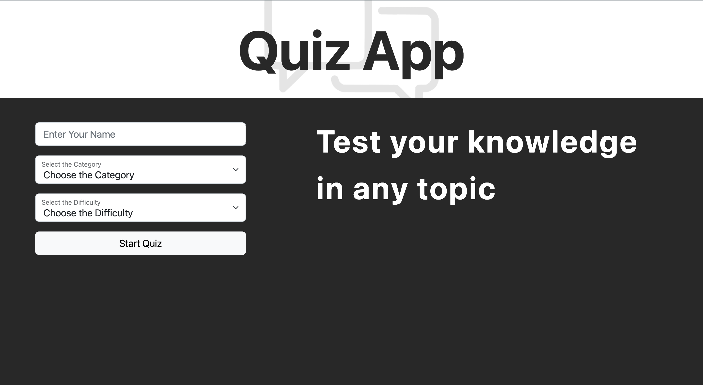

# Quiz App 🧐✅

A simple quiz app with opportunity of choosing a category of 10 questions and theirs difficulty.

## Tech Stack

**Client:** React(Hooks), React-hook-form, React-Router, React-Bootstrap


## FAQ

#### How long has it been in development?

Development took about a 3 days


## Screenshots




## Run Locally

Clone the project

```bash
  git clone https://github.com/thatsfov1/quiz-app.git
```

Go to the project directory

```bash
  cd quiz-app
```

Install dependencies

```bash
  npm install
```


